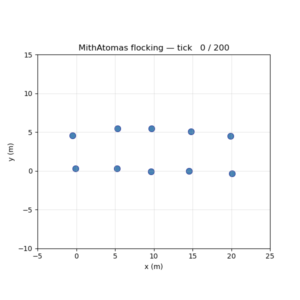

# MithAtomas

Swarm robotics orchestration runtime — C++17.

> **Decentralised by default. Composable by design. Hardware-agnostic by necessity.**

See [ARCHITECTURE.md](ARCHITECTURE.md) for the authoritative design.

<table>
<tr>
<td width="55%">

10 simulated robots starting in a 5×2 grid and flocking through `BeaconSystem` + `FlockingSystem` + `KinematicsSystem`. From `t=0` to `t=200` the mean radius around the centroid contracts ~70% (6.87 m → 2.10 m) — cohesion + alignment pull the flock together; separation keeps them from overlapping.

Frames captured live; rendered by `tools/visualiser/visualise.py`. Reproduce with [the demo command](#run-the-flocking-demo). Full sequence at `docs/assets/flocking_demo.png`.

</td>
<td width="45%" align="center">



</td>
</tr>
</table>

---

## Status — v0.1 feature complete

| Area | What ships |
|---|---|
| Identity | `UUID` (RFC 4122 v4), `HierarchicalID`, `IdentityKey` + `IdentityVerifier` stubs (Ed25519 deferred to v0.2), `IdentityRotationPolicy` + `World::rotate_identity()` stub |
| ECS | `EntityRegistry` (registration policies, view, snapshot, ComponentOrigin tag, sink-wired audit), all 10 §4.4 built-in components, `BoundedQueue<T,N,Policy>` |
| Scheduling | `SystemDescriptor` two-axis hazards, `SystemScheduler` with both `Sequential` and `Parallel` modes (thread pool + hazard DAG), `last_tick_timings()` |
| Comms | `StateVector`, `Message`, `NeighbourTable`, `TransportLayer`, `BeaconSystem`, `BROADCAST_ID` semantics |
| Motion | `FlockingSystem` (Reynolds), `KinematicsSystem` |
| Sim | `SimClock`, `SimBus` (range-limited delivery), `SimTransport` |
| Observability | Hand-rolled JSON writer, `TraceSink` interface + `JsonTraceSink` + `NullTraceSink`, `World::dump_state()`, `component_registered` / `tick_completed` audit events |
| Runtime | `World` (config, init, tick, run, identity, transport, neighbour table, scheduler / registry forwarders, sink wiring) |
| Demo | 10-robot flocking demo + matplotlib visualiser |
| Build | CMake STATIC library, install target with `find_package(mith-atomas)` config, doctest-vendored test suite |

Test suite: **275 cases, 13,149 assertions, all passing.**

Pre-v0.1 design phase: **9/9 questions resolved** (see [ARCHITECTURE.md §16](ARCHITECTURE.md#16-roadmap)).

v0.2 next — see the [roadmap](ARCHITECTURE.md#16-roadmap):
discovery / bootstrap protocol, channel-aware transport, **cryptographic identity (Ed25519 + ChaCha20 CSPRNG)**, identity rotation impl, `FaultMonitorSystem` + active degraded mode, `UDPMulticastTransport`, `TaskAllocSystem`, fault-injection + spoofing-rejection integration tests.

---

## Build

```sh
cmake -B build -S .
cmake --build build -j$(nproc)
```

## Test

```sh
cd build && ctest --output-on-failure
# Or the binary directly for the doctest summary:
./build/tests/mith_unit_tests
```

Single test case:

```sh
./build/tests/mith_unit_tests -tc='Parallel mode: hazardous systems run in lex order'
```

Stress (re-run the whole suite N times — catches flaky entropy / timing):

```sh
./build/tests/mith_unit_tests --count=100
```

List every case:

```sh
./build/tests/mith_unit_tests --list-test-cases
```

## Run the flocking demo

```sh
./build/examples/flocking_demo/flocking_demo | python3 tools/visualiser/visualise.py
```

10 simulated robots running `BeaconSystem` + `FlockingSystem` + `KinematicsSystem` in a `SimBus`. 200 ticks at 20 Hz (10 s sim time). The C++ side emits one JSON object per tick to stdout; the Python script animates them as a 2D scatter. Requires `matplotlib` on the Python side; nothing else.

For headless capture (e.g., CI):

```sh
./build/examples/flocking_demo/flocking_demo > /tmp/demo.jsonl
```

## Install

```sh
cmake --install build --prefix /your/install/prefix
```

Installs `libmith.a`, headers under `include/mith/`, and CMake package config under `lib/cmake/mith-atomas/`. Downstream consumers:

```cmake
find_package(mith-atomas REQUIRED)
target_link_libraries(my_robot PRIVATE mith::mith)
```

## CMake options

| Option | Default | Purpose |
|---|---|---|
| `MITH_BUILD_EXAMPLES` | `ON`  | Build the flocking demo |
| `MITH_BUILD_TESTS`    | `ON`  | Build the test suite |
| `MITH_BUILD_SIM`      | `ON`  | Build the simulation harness (reserved — currently always on) |
| `MITH_ENABLE_UDP`     | `ON`  | Build UDP transport (lands v0.2) |
| `MITH_ENABLE_SERIAL`  | `OFF` | Build serial transport (lands v0.3) |
| `MITH_ENABLE_AUTH`    | `OFF` | Build cryptographic identity / Ed25519 signed mode (lands v0.2) |

---

## Architecture pointer

[`ARCHITECTURE.md`](ARCHITECTURE.md) is the spec. Quick map:

- **§3** Identity — `HierarchicalID`, signed/unsigned modes, rotation policies
- **§4** ECS — registry, components, type system, bounded queues
- **§5** System model — two-axis hazards, scheduler modes (Sequential / Parallel)
- **§6** Action handler registry
- **§7** Comms — `StateVector`, `Message`, `NeighbourTable`, transport, broadcast semantics
- **§8** `World` — top-level runtime, lifecycle, config
- **§9** Simulation harness
- **§13** Fault tolerance + EW posture (§13.5)
- **§14** Observability — `TraceSink`, JSON writer, `dump_state`, `last_tick_timings`
- **§15** Constraints + platform tier (SoC-class — Pi, Jetson, BeagleBone)
- **§16** Roadmap

---

## Contributing

PRs welcome. Read [CONTRIBUTING.md](CONTRIBUTING.md) for setup, conventions, commit style, and what we look for in review. The [Code of Conduct](CODE_OF_CONDUCT.md) governs all community spaces — issues, PRs, discussions.

Templates:

- `.github/PULL_REQUEST_TEMPLATE.md` — auto-applied on new PRs
- `.github/ISSUE_TEMPLATE/bug_report.md`
- `.github/ISSUE_TEMPLATE/feature_request.md`
- `.github/ISSUE_TEMPLATE/question.md`

For security-relevant issues (anything touching §3.3 identity, §13.5 EW posture, or transport auth), do not file a public issue — email the maintainer directly. See [CONTRIBUTING.md](CONTRIBUTING.md#reporting-security-issues).

## License

Apache 2.0 — see [LICENSE](LICENSE).
